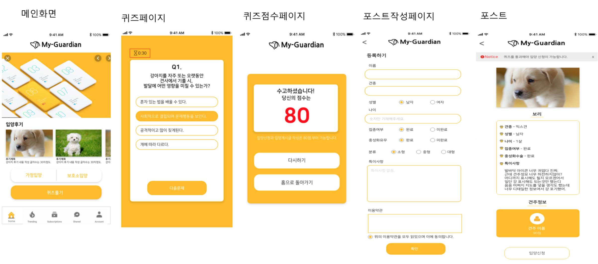

# 집사할래?(My-Guardian)
Would you be my guardian?

## Intro
 - 신뢰도 높고 올바른 반려동물 입/분양 앱서비스입니다.<br>
 

**기획배경 :** 
1. 다수의 예비반려인이 반려동물에 대한 올바른 정보를 접하기 어려움
2. 반려동물 분양자는 입양자를 신뢰하기 어려움
3. 강아지공장, 펫샵과 같은 불법적인 분양창구 다수 활성화

**기대효과:**
1. 퀴즈점수 교환을 통해 상호간의 신뢰도 상승
2. 제3자가 주선하는 오프라인 미팅을 통해 안심 입/분양 가능
3. 가정/보호소 분양과 같은 합법적 입양창구 활성화 ->  올바른 입양문화 정착에 이바지

## Developer

- Guinness
- TaeBbong

## Tech Stack

Back-end : DRF(Django Rest Framework)<br>
Front-end : Flutter

## Getting Started
-가상환경 설치
```python
python -m venv (venvname)
source (venvname)/bin/activate
```
-필요 라이브러리 설치
```python
pip install -r requirements.txt
```

